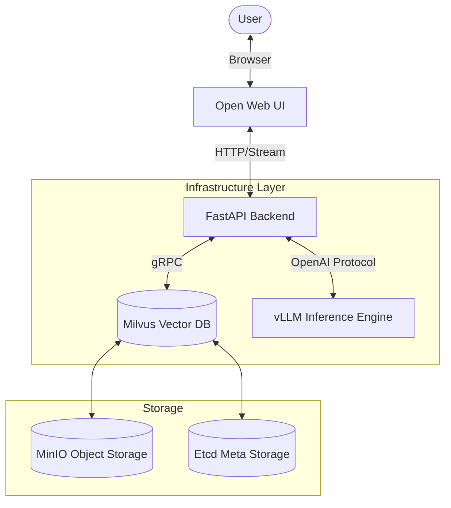

# 🔒 Secure Enterprise RAG

[](https://www.python.org/)
[](https://fastapi.tiangolo.com/)
[](https://github.com/vllm-project/vllm)
[](https://milvus.io/)
[](https://www.docker.com/)

A production-ready, self-hosted **Retrieval-Augmented Generation (RAG)** system designed for high-security enterprise environments.
It operates entirely offline, ensuring **zero data leakage** to public APIs like OpenAI.

---

## 🏗 Architecture

The system follows a **Microservices Architecture** running on Docker Compose.



### Key Features
*   **Hybrid Search:** Combines **Dense Embeddings** (BAAI/bge-m3) with **Sparse Keywords** (BM25) for maximum retrieval accuracy.
*   **Privacy First:** Fully local execution. No external calls.
*   **SOTA Inference:** Uses **vLLM** with PagedAttention for high-throughput token generation.
*   **Smart Ingestion:** Asynchronous PDF parsing pipeline with automatic chunking.
*   **Citation:** The model cites source documents in its answers (Enterprise Compliance).

---

## 🚀 Quick Start

### Prerequisites
*   **Linux/WSL2** (Recommended)
*   **NVIDIA GPU** + NVIDIA Container Toolkit installed.
*   **Docker** & **Docker Compose**.
*   **Make** (Optional, for convenience).

### 1. Installation

```bash
# Clone the repository
git clone https://github.com/pueraeternis/secure-enterprise-rag.git
cd secure-enterprise-rag

# Configure environment
cp .env.example .env
# (Optional) Edit .env to select your GPU model
```

### 2. Deployment

We use a Makefile to simplify Docker operations.

```bash
# Build and start services (Backend, vLLM, Milvus, WebUI)
make up
```
*Initial launch may take a few minutes to download LLM weights (approx. 5-15GB depending on model).*

### 3. Usage

1.  **Access the Web UI:** Open [http://localhost:3000](http://localhost:3000)
2.  **Upload Documents:**
    *   Go to API Docs: [http://localhost:8000/docs](http://localhost:8000/docs)
    *   Use `POST /api/v1/ingest/file` to upload a PDF.
3.  **Chat:** Return to Web UI and ask questions about your documents.

---

## 🛠 Tech Stack

| Component | Technology | Description |
| :--- | :--- | :--- |
| **LLM Engine** | **vLLM** | High-performance inference server (OpenAI compatible). |
| **Vector DB** | **Milvus** | Enterprise-grade vector database for hybrid search. |
| **Backend** | **FastAPI** | Async Python API handling RAG logic & ingestion. |
| **RAG Logic** | **LlamaIndex** | Orchestration of retrieval and prompting. |
| **Frontend** | **Open Web UI** | ChatGPT-like interface for users. |
| **Package Mgr** | **uv** | Blazing fast Python package installer. |

---

## 📂 Project Structure

```text
src/
├── app/                 # FastAPI Application (Routers, Middleware)
├── core/                # Global configs & Logging
├── domain/              # Business Logic Data Models (Clean Architecture)
├── infrastructure/      # Adapters (Milvus, vLLM Client, PDF Parsers)
└── services/            # Core RAG Logic (Retrieval, Ingestion)
tests/                   # Integration & Unit Tests (pytest)
deploy/                  # Docker Compose & Infrastructure Configs
```

---

## 🧪 Testing

The project includes comprehensive Unit and Integration tests.

```bash
# Run tests using uv (in a fresh environment)
uv run pytest -v
```

## 📜 License

MIT License.
